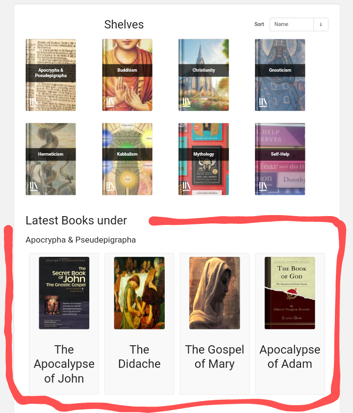

# Latest-Books-Widget-for-BookStack
This code show the latest books under a shelf id . You can use as @include or offer a widget for people to add to their site

## How to Use it

the js file must be placed in public/dist folder if you want to use as an external widget an included in external sites like this 

<pre><code><pre><code>
&lt;script type=&quot;text/javascript&quot; src=&quot;https://yousite.com/dist/widgets/five.js&quot;&gt;&lt;/script&gt;
&lt;div&gt;
   &lt;h3&gt;Latest Books under &lt;/h3&gt;&lt;h4 id=&quot;shelf-name&quot;&gt;&lt;/h4&gt;
   &lt;div id=&quot;bookshelf-container&quot;&gt;    &lt;!-- Books will be loaded here --&gt;
   &lt;/div&gt;
&lt;/div&gt;
</code></pre></code></pre>

to use in your own site you can include the same way don't forget to use nonce, or create a blade and add th code and use the @include method 
   <pre><code><pre><code>
&lt;script nonce=&quot;{{ $cspNonce }}&quot;type=&quot;text/javascript&quot; src=&quot;https://yousite.com/dist/widgets/five.js&quot;&gt;&lt;/script&gt;
&lt;div&gt;
   &lt;h3&gt;Latest Books under &lt;/h3&gt;&lt;h4 id=&quot;shelf-name&quot;&gt;&lt;/h4&gt;
   &lt;div id=&quot;bookshelf-container&quot;&gt;    &lt;!-- Books will be loaded here --&gt;
   &lt;/div&gt;
&lt;/div&gt;
</code></pre></code></pre>

this code is taking books from shelf id 5, you can change that, and you can duplicate and rename the file to have the latest books from several shelfs. 
